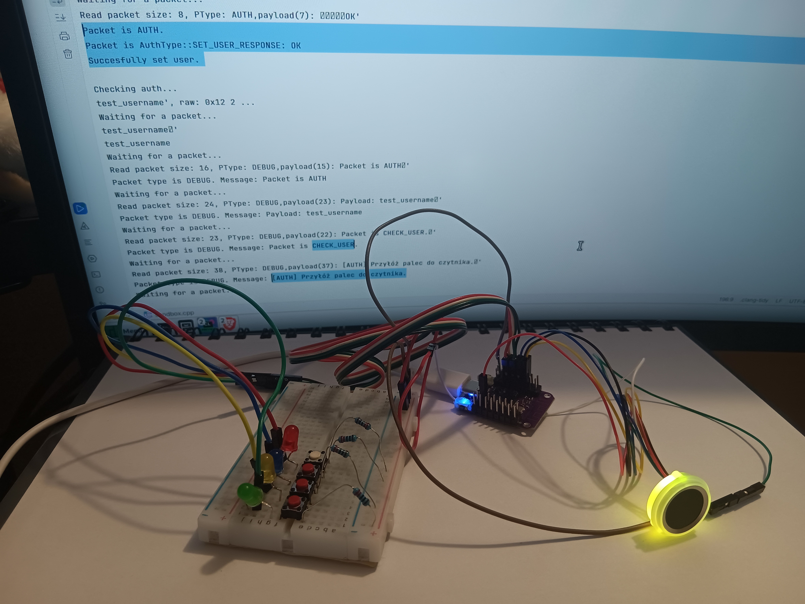
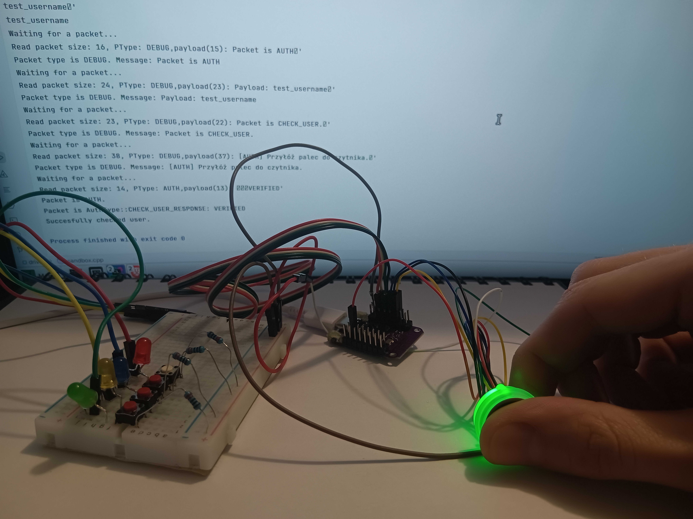
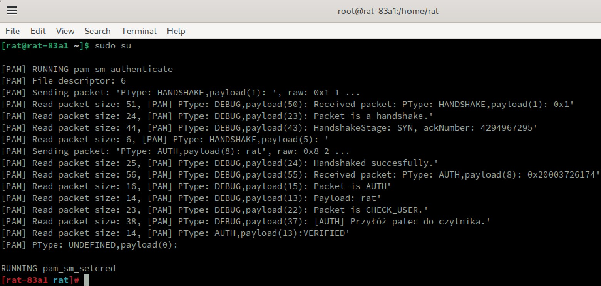

# RAT - fingerprint sensor integrated with mouse

A computer mouse with a biometric authentication system combining fingerprint scanning hardware (ESP32-based) with Linux PAM (Pluggable Authentication Modules).
Mouse side of the project ended as 4 buttons moving the cursor so technically it is a mouse (terrible one) but a mouse.

## Overview
### Sequence diagram [PL] 

RAT is a two-part authentication solution:
1. **ESP32 Firmware** - Runs on a WEMOS LOLIN-S2-MINI board with SFM-V1.7 fingerprint scanner
2. **PAM Module** - Linux PAM integration for system-level authentication using the fingerprint device

The system enables users to authenticate on Linux systems using fingerprint biometrics instead of traditional passwords.

### In Action

#### Fingerprint Enrollment Process

*Enrolling a new fingerprint - LED shows purple/blue during capture*

#### Ready for Authentication

*Device ready - waiting for fingerprint to verify identity*

#### Successful Authentication

*Authentication successful - green LED confirms identity*

#### Linux auth

*Complete hardware setup with fingerprint scanner and ESP32*

## Hardware Components

- **Microcontroller**: WEMOS LOLIN-S2-MINI (ESP32-S2)
- **Fingerprint Scanner**: SFM-V1.7 Module
- **Communication**: USB Serial (CDC)
- **Additional**: USB HID support for mouse emulation (optional feature)

### Pin Configuration

| Component | Pin | Wire Color |
|-----------|-----|------------|
| FP UART RX | GPIO_NUM_4 | Black |
| FP UART TX | GPIO_NUM_5 | Yellow |
| FP UART IRQ | GPIO_NUM_6 | Blue |
| FP UART VCC | GPIO_NUM_7 | Green |
| Main Button | GPIO_NUM_0 | - |
| Main LED | LED_BUILTIN | - |

## Features

### Fingerprint Management
- **3C3R Registration**: Three-capture, three-recognition method for fingerprint enrollment
- **1:N Recognition**: Identify user from database
- **1:1 Verification**: Verify specific user
- **User Management**: Add, delete individual users or clear entire database
- **Visual Feedback**: RGB LED ring indicators for operation status

### PAM Integration
- **System Authentication**: Use fingerprints for login, sudo, and other PAM-enabled services
- **Credential Management**: Enrollment and deletion through PAM interface
- **Secure Communication**: Custom packet protocol over USB serial
- **Handshake Protocol**: Connection verification before authentication

### Communication Protocol

Custom packet-based protocol with the following packet types:
- `DEBUG` - Debugging information
- `HANDSHAKE` - Connection establishment (SYN, SYN-ACK, ACK)
- `AUTH` - Authentication requests and responses
  - `SET_USER` - Register new fingerprint
  - `CHECK_USER` - Authenticate user
  - `REMOVE_USER` - Delete fingerprint
  - Corresponding response types

## Project Structure

```
RAT/
├── src/                    # ESP32 firmware source
│   ├── main.cpp           # Main application logic
│   ├── sfm.cpp            # SFM fingerprint module driver
│   └── usb_connection.cpp # USB serial communication
├── include/               # Firmware headers
│   ├── sfm.hpp            # SFM module interface
│   ├── control.h          # GPIO control definitions
│   ├── usb_connection.h   # USB communication interface
│   ├── packet.h           # Packet protocol definitions
│   └── converters.h       # Data conversion utilities
├── driver/                # Linux PAM module
│   ├── pam_fp.cpp         # Main PAM module implementation
│   ├── pam_fp_add_cred.cpp    # Credential addition utility
│   ├── pam_fp_delete_cred.cpp # Credential deletion utility
│   ├── pam_fp_test.cpp    # Testing utility
│   ├── CMakeLists.txt     # Build configuration
│   └── serial/            # Serial communication for Linux
│       ├── serial.cpp     # Serial port handling
│       ├── packet.cpp     # Packet protocol implementation
│       ├── packet.h       # Packet definitions
│       └── converters.h   # Data conversion utilities
├── lib/                   # PlatformIO libraries
├── test/                  # Test files
├── platformio.ini         # PlatformIO configuration
└── copyFromDriver.py      # Build script to sync shared files
```

## Dependencies

### Firmware (ESP32)
- **Platform**: Espressif32
- **Framework**: Arduino
- **Libraries**:
  - Adafruit TinyUSB Library (^2.3.3)
  - ESP32 Hardware Serial
  - USB CDC support

### PAM Module (Linux)
- **Build System**: CMake (>= 3.28)
- **C++ Standard**: C++26
- **Libraries**:
  - libpam-dev
  - libpam-misc

## Building

### ESP32 Firmware

1. Install [PlatformIO](https://platformio.org/)
2. Build and upload:
```bash
pio run --target upload
```

3. Monitor serial output:
```bash
pio device monitor
```

The build process automatically copies shared packet protocol files from `driver/serial/` to `include/` and `src/` using `copyFromDriver.py`.

### PAM Module

1. Navigate to driver directory:
```bash
cd driver
```

2. Build with CMake:
```bash
mkdir build && cd build
cmake ..
make
```

3. Install PAM module (requires root):
```bash
sudo cp libmy_pam_fp.so /lib/x86_64-linux-gnu/security/pam_fp.so
```

## Installation & Configuration

### 1. Flash ESP32 Firmware
Upload the firmware to your WEMOS LOLIN-S2-MINI board.

### 2. Install PAM Module
Copy the compiled PAM library to the system security directory.

### 3. Configure PAM
Edit PAM configuration files (e.g., `/etc/pam.d/sudo`):
```
auth sufficient pam_fp.so
```
or
```
auth required pam_fp.so
```

### 4. Device Path
Update device path in PAM module source if needed:
```cpp
constexpr auto authDevicePath = "/dev/serial/by-id/usb-WEMOS.CC_LOLIN-S2-MINI_0-if00";
```

### 5. Enroll Fingerprints
Use the provided utility:
```bash
./pam_fp_add_cred
```

## Usage

### Enrolling a Fingerprint

1. Run the credential addition tool or trigger through PAM
2. Follow LED indicators:
   - **Purple/Blue pulse**: Place finger (stage 1)
   - **Green**: Success, remove finger
   - **Purple/Cyan pulse**: Place finger (stage 2)
   - **Green**: Success, remove finger
   - **Purple/Cyan pulse**: Place finger (stage 3)
   - **Green**: Enrollment complete
   - **Red**: Error occurred

3. Three successful captures required for enrollment

### Authenticating

1. When prompted by PAM (login, sudo, etc.)
2. Place finger on scanner
3. Wait for LED feedback:
   - **Green**: Authentication successful
   - **Red**: Authentication failed

### Deleting a Fingerprint

```bash
./pam_fp_delete_cred
```

## LED Indicators

| Color | Meaning |
|-------|---------|
| Blue | Idle/Ready |
| Purple | Processing |
| Green | Success |
| Red | Error/Failure |
| Yellow | Authentication check mode - waiting for fingerprint to verify |
| Cyan | Waiting for input |
| Off | Disabled |

## Communication Protocol Details

### Packet Structure
```
[uint32_t: PayloadSize][uint8_t: PacketType][payload]
```

### Handshake Sequence
1. Client → Device: SYN
2. Device → Client: SYN-ACK
3. Client → Device: ACK
4. Connection established

### Authentication Flow
1. Handshake
2. Client sends AUTH packet with username
3. Device initiates fingerprint scan
4. Device sends response (OK/FAIL)

## Utilities

- **pam_fp_add_cred**: Add fingerprint credentials
- **pam_fp_delete_cred**: Remove fingerprint credentials  
- **pam_fp_test**: Test PAM authentication
- **sandbox**: Development testing environment

## Configuration

### PlatformIO Settings
- **Platform**: espressif32
- **Board**: lolin_s2_mini
- **Framework**: Arduino
- **Build Type**: Debug
- **C++ Standard**: gnu++2a (C++20)
- **Monitor Speed**: 230400 baud
- **Upload Port**: /dev/ttyACM*

## Development Notes

- Code uses modern C++ features (C++20/26)
- Packet protocol is shared between firmware and driver
- Build script (`copyFromDriver.py`) maintains file synchronization
- Debug messages available through USB CDC serial
- Supports IRAM-optimized interrupt handlers for responsiveness

## Security Considerations

⚠️ **Important Security Notes:**
- This is an educational/experimental project
- Fingerprint data is stored locally on the SFM module
- USB serial communication is not encrypted
- Should be used in controlled environments
- Consider additional security layers for production use

## Troubleshooting

### Device Not Found
- Check USB connection
- Verify device path: `ls /dev/serial/by-id/`
- Check permissions: `sudo usermod -a -G dialout $USER`

### Fingerprint Scanner Not Responding
- Verify pin connections
- Check VCC power supply
- Monitor serial debug output
- Ensure SFM module firmware is compatible

### PAM Module Issues
- Check PAM configuration syntax
- Review system logs: `journalctl -xe`
- Test with debug utilities first
- Verify library installation path

## License

WTFPL or whatever

## Credits

- **SFM Module Driver**: Based on work by [Matrixchung](https://github.com/Matrixchung)
- **ESP32 Platform**: Espressif Systems
- **TinyUSB**: Adafruit Industries